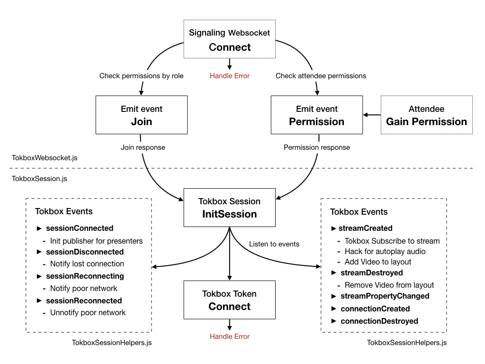
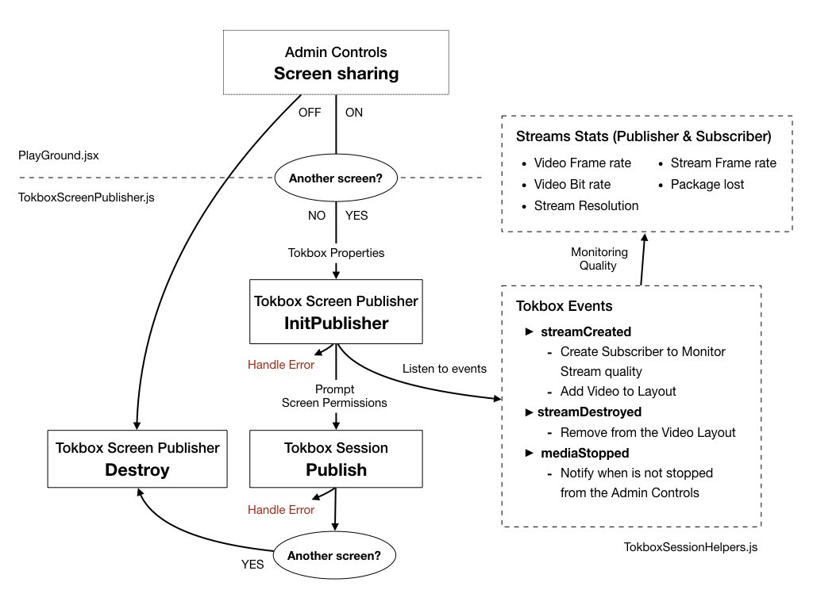

# TOKBOX INTEGRATION

# Code Review

The following files are in this repo for a code review to find possible ways to improve how we use the Tokbox JS SDK. Some points for the review are the error handling, the optimization and the monitoring of the streaming quality and the general performance.

- **TokboxWebsocket.js**

  Handles the websocket connection to our singaling server. We use Tokbox NODE SDK in that server to create the sessions, user tokens, start archiving... 

- **TokboxSession.js**

  Handles the Session initilization, connection and attaches the session event listeners after the Tokbox webscket receives the Session ID, apiKey and user token.

- **TokboxSessionHelpers.js**

  Contains the event listener callbacks for the Session, Connection and Streams. Also, shares functions for error handling and UI helpers.

- **TokboxPublisher.js**

  Handles the publisher initialization, publication of audio and video streams, change of the audio or video input. Handles errors and attaches the publisher event listeners. Subcribes to its own stream for monitoring the stats about the streaming quality. Uses our hack for the audio autoplay.

- **TokboxScreenPublisher.js**

  Handles the publisher initialization, publication of screen-sharing, errors and attaches the publisher event listeners. Subcribes to its own stream for monitoring the stats about the streaming quality. 

- **TokboxSubscriber.js**

  Handles the subcriber creation when a stream is created. Attaches an event to listen the audio level updates to animate the user card. Also controls the prefered stream resolution and the framerate restricttion for the layout with small webcams.

- **TokboxStreamStats.js**

  Handles the streams stats of publishers and subscribers to know the audio and video bitrate, framerate and package lost (pending).

- **audioAutoplay.js**

  Creates silent videos with permissions to autoplay audio because are created right after the user clicks on the button to join the room. Then when a stream is created uses a video with permissions updating the srcObject attribute with the MediaStream from the video created by Tokbox.

# Flow Diagrams

# Test in a Session
The Demio Viewer prototype is not online yet. It's coming soon! 

Here join links for the session:

- Presenter 1: https://event.staging.demio.com/join/[user-hash]
- Presenter 2: https://event.staging.demio.com/join/[user-hash]
- Reg page for attendees: https://my.staging.demio.com/ref/[event-hash]

The features for attendeees to subcribe and even publish when they are granted pemissions to share their devices is still pending.